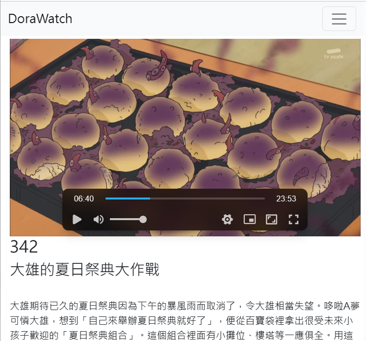
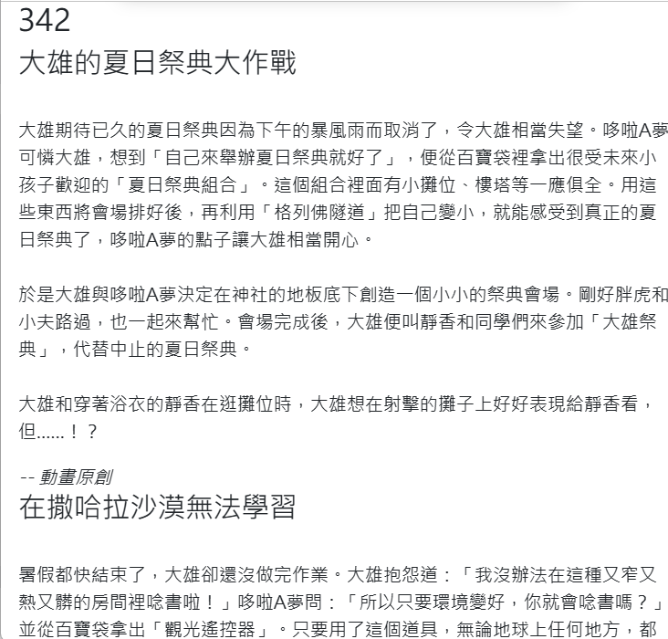
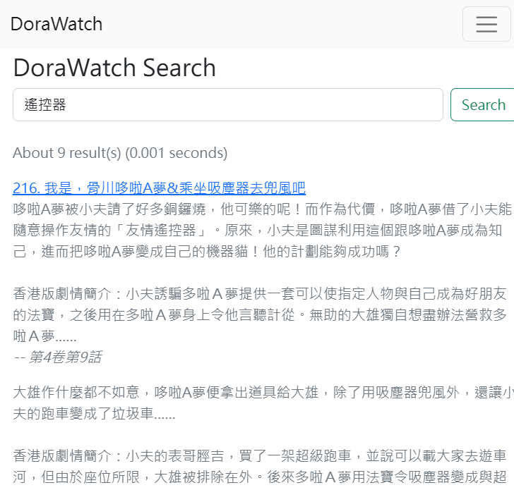
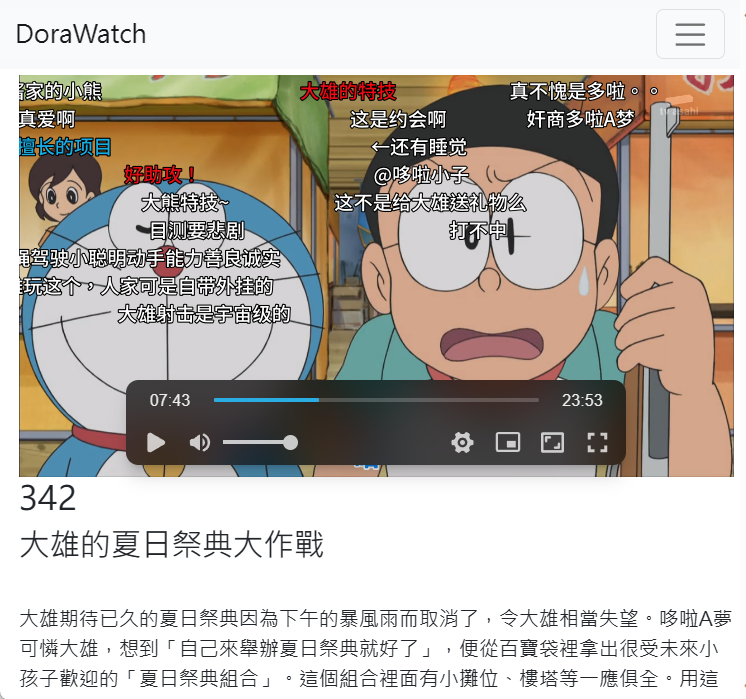
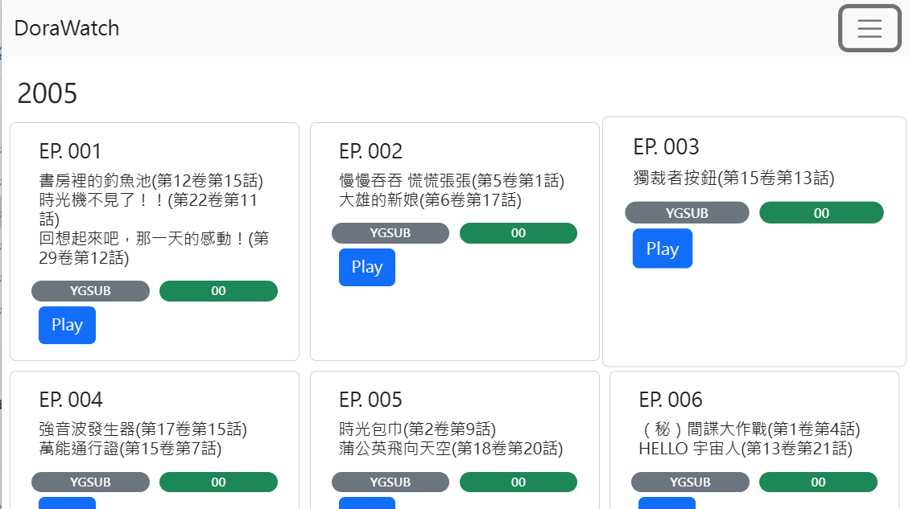

# DoraPlay
A ultimate frontend allowing you to manage and watch your favourite Doraemon episode easily.

# Features
- Watching Episodes with description, source below each episode

  

- Searching by description, original source, episode name and no.

- 

- Danmaku support for episodes uploaded by '喜欢拉面' on bilibili.

- Beautiful user interface for sorting by year.

  

! Data source: 貓吧, chinesedora.com, Wikipedia, Doraemon wiki

# Getting Data

As data source come from (some copyrighted data), we will fetch the information by ourselves.

See 'unified_data/steps.md' for more information

* Videos, Description are not provided by default by the repository.