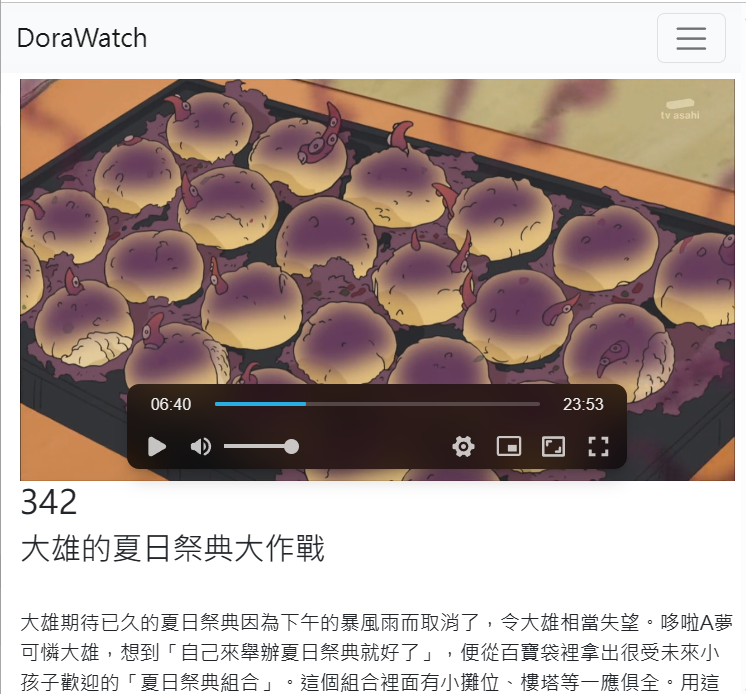
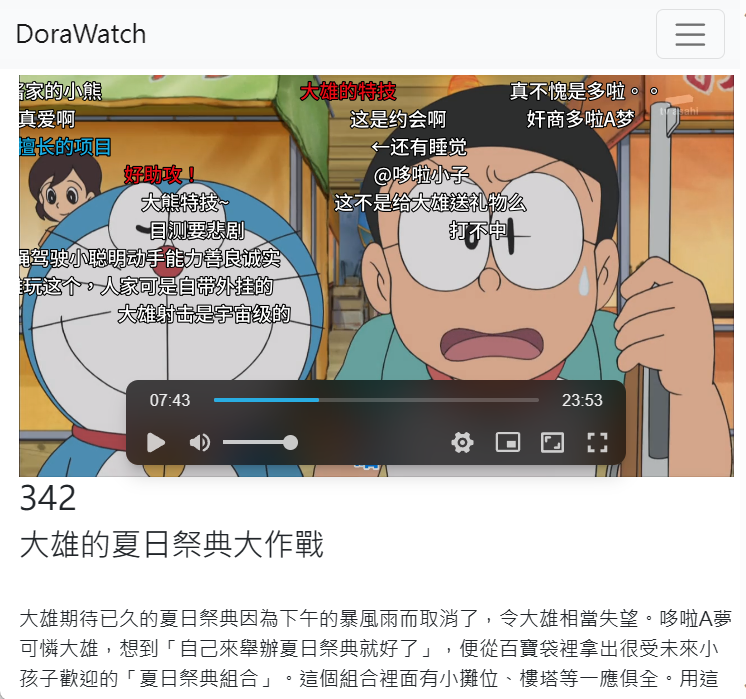

## Languages/语言
[简体中文](readme_zh.md) [English](readme.md)

# DoraPlay
让您轻松搜索和观看您最喜爱的"哆啦A梦"的终极前端。

# 功能
- 每集下方带有故事來源和描述

- 按描述、故事來源、名称和集数搜索。 (*)

- 弹幕支持'喜欢拉面'在bilibili上传的集数.

- 按年份排序的界面。

### !数据来源：猫吧、chirenedora.com、维基百科、哆啦A梦wiki

# 获取数据

由于数据来自某些受版权保护的来源，我们将自行获取信息。

有关详细信息，请参阅[Steps](unified_data/steps_zh.md)

* Repo默认不提供视频、故事描述。
