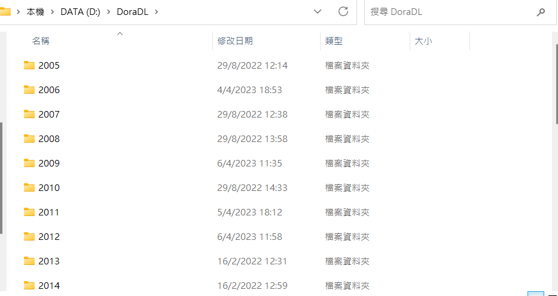

1. Prepare the data (provided)
2. Run 'chinesedora_description.py'
3. Run 'story_fetch.py'
4. Run 'episode_to_story_mapping.py'
4.5. (You can edit 'get_videos.py' (Episode must be single file[If there is an episode named 555(1), 555(2), you must merge it.]))
4.5 Notes:
- File structure
  Folders By Year -> Episode By Different Sub Firms.
  Example:
  
  2012/
  
- Run the 'get_video.py' in your video root directory.(Place danmaku folder in it also)
- Host it on localhost(Find any tool or Windows IIS)
4.9. Copy 'tv.json' to unified_data folder.
5. Run 'merge_story_description_episode.py'
6. Copy 'ntv.json' to root of application
6.5. Edit static/templates/play.html
    From: 'http://192.168.0.30:9876/{{year}}/{{epvid|safe}}'

    To: 'http://serverip:port/{{year}}/{{epvid|safe}}'

    From: 'http://192.168.0.30:9876/danmaku/{{episode}}.ass'

    To: 'http://serverip:port/danmaku/{{episode}}.ass'
7. Launch python server