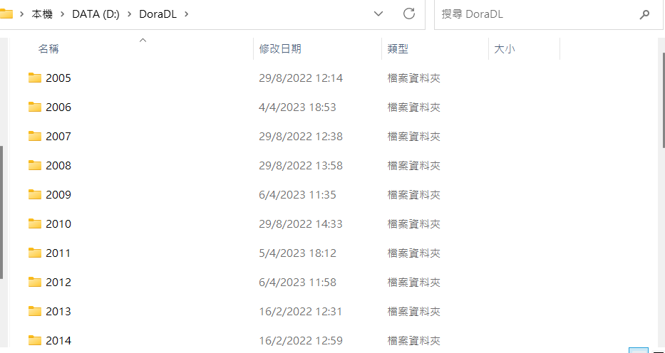
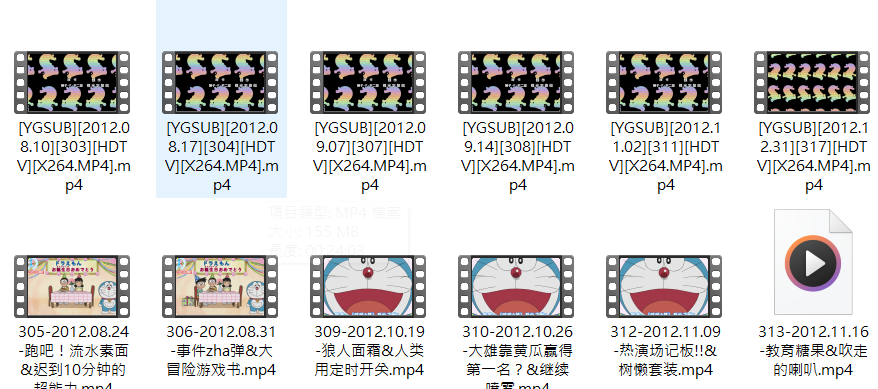

1. 准备数据（已提供）(如果您需要弹幕，请将assets/danmaku.zip解压缩到您的视频根目录目录中。)
2. 运行'chinesedora_description.py'
3. 运行'story_fetch.py'
4. 运行“episode_to_story_mapping.py”
4.5. （你可以编辑'get_videos.py'（视频必须是单个文件[如果有一个名为555（1），555（2）的视频，你必须合并它。]）

4.5 注意事项：

!!!! 视频和前端是分开的，请记住在开始之前托管您的视频并编辑 HTML。

- 文件结构

   按年份分类的文件夹 -> 不同字幕组的视频
   例子：
   
   
   2012/
   
   
- 在您的视频根目录中运行“get_video.py”。（也将弹幕文件夹放入其中）
- 将其托管在本地主机上（任何工具或 Windows IIS）
* 尝试访问'http://serverip:port/danmaku/543' 试是否有效

4.9. 将“tv.json”复制到 unified_data 文件夹。
5. 运行“merge_story_description_episode.py”
6. “ntv.json”复制到应用程序的根目录
6.5. 编辑 static/templates/play.html
     From：'http://192.168.0.30:9876/{{year}}/{{epvid|safe}}'

     To：'http://serverip:port/{{year}}/{{epvid|safe}}'

     From：'http://192.168.0.30:9876/danmaku/{{episode}}.ass'

     To: 'http://serverip:port/danmaku/{{episode}}.ass'
7.启动python服务器
~~~~~~~~~~~~~~~~~~~~~~~~~~~~~~~~~~~~~~~~~~~~~~~~~~~~~~~~~~~
